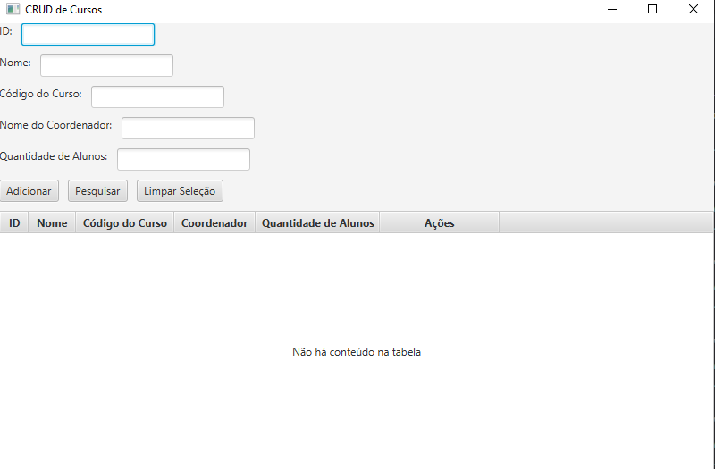

##  Curso (Boundary, Control e Entity) - Simplificado

Exercício - Curso (Boundary, Control e Entity) – Simplificado Usando Java FX

Crie um CRUD para fazer a manutenção de cursos, contendo o Boundary, o Control e a Entidade (BCE), vinculando os componentes gráficos do tipo TextField com as propriedades do curso na camada Control, contendo um botão para adicionar novo curso e outro para pesquisar, conforme layout abaixo:

Curso:

Id        
Nome
Código do Curso
Nome do Coordenador
Quantidade de alunos

